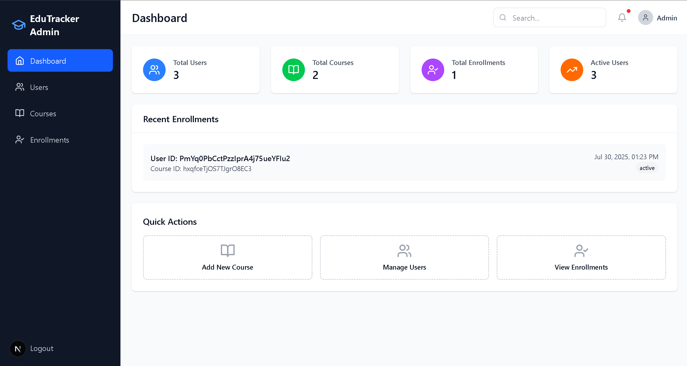
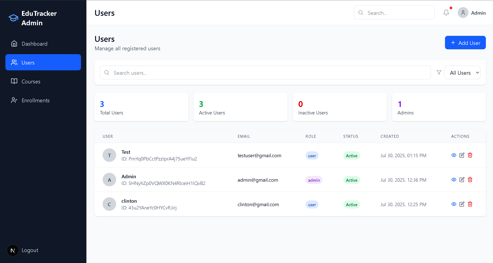

# EduTracker Admin Panel

<div align="center">
  <h3>Modern Educational Management System</h3>
  <p>Next.js admin panel for managing courses, users, and enrollments with Firebase integration</p>
</div>

---

## Screenshots

### Dashboard Overview

*Real-time analytics, statistics, and quick actions for efficient management*

### User Management

*Comprehensive user management with search, filtering, and status controls*

---

## Features

### Admin Authentication
- Secure login system with Firebase Authentication
- Admin role-based access control
- Session management and logout functionality

### Dashboard
- Real-time statistics and analytics
- Recent enrollments overview
- Quick action buttons for common tasks
- Beautiful data visualization cards

### User Management
- View all registered users
- Search and filter users by status, role
- Toggle user active/inactive status
- User details and profile management

### Course Management
- Complete CRUD operations for courses
- Course creation with rich form validation
- Course editing and status management
- Beautiful course cards with detailed information
- Search and filter functionality

###  Enrollment Management
- View all course enrollments
- Update enrollment status (enrolled, completed, dropped, suspended)
- Search enrollments by user or course
- Enrollment analytics and statistics

## Tech Stack

- **Framework**: Next.js 15.4.5 with App Router
- **Styling**: Tailwind CSS 4.0
- **Database**: Firebase Firestore
- **Authentication**: Firebase Auth
- **Icons**: Lucide React
- **Language**: JavaScript/React

## Project Structure

```
edutracker/
├── app/
│   ├── page.js                 # Dashboard
│   ├── login/
│   │   └── page.js             # Admin login
│   ├── users/
│   │   └── page.js             # User management
│   ├── courses/
│   │   └── page.js             # Course management
│   ├── enrollments/
│   │   └── page.js             # Enrollment management
│   ├── layout.js               # Root layout
│   └── globals.css             # Global styles
├── components/
│   ├── Layout.js               # Main layout wrapper
│   ├── Sidebar.js              # Navigation sidebar
│   ├── Header.js               # Top header
│   ├── UserTable.js            # User management table
│   ├── CourseForm.js           # Course creation/editing form
│   ├── EnrollmentTable.js      # Enrollment management table
│   └── LoadingWidget.js        # Loading component
├── lib/
│   ├── firebase.js             # Firebase configuration
│   └── auth.js                 # Authentication utilities
└── utils/
    └── helpers.js              # Utility functions
```

## Quick Start Guide

### Prerequisites

- **Node.js 18+** - [Download here](https://nodejs.org/)
- **Git** - [Download here](https://git-scm.com/)
- **Firebase Account** - [Sign up here](https://firebase.google.com/)
- **Code Editor** - VS Code recommended

### Installation Steps

#### 1. **Clone & Setup Project**
```bash
# Clone the repository
git clone git@github.com:Clinton-mugisha/edutracker-admin.git
cd edutracker

# Install dependencies
npm install

# Run the development server
npm run dev
```

#### 2. **Login with Admin Credentials**

```bash
Email: admin@gmail.com
Password: Admin@2025.
```
